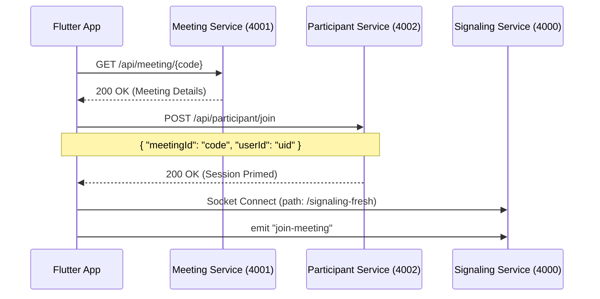

# Flutter Integration: Joining an Existing Meeting

This guide explains the correct API sequence for a Flutter developer to join an existing meeting using a meeting code. 

> [!IMPORTANT]
> **Common Error**: Do NOT use the `POST /api/meetings/create` endpoint for joining. This endpoint creates a new meeting record. If you pass an existing code, it may error or behave unexpectedly. Follow the **Validate -> Register -> Connect** flow below.

---

## 1. The Join Flow

To correctly join a meeting and ensure parity with Web/Desktop participants, follow this sequence:



---

## 2. API Reference

### A. Step 1: Validate Meeting (Meeting Service)
Verify that the meeting exists before attempting to connect.
- **URL**: `https://mizdah-backend.ogoul.cloud/api/meeting/{meeting_code}`
- **Method**: `GET`
- **Normalization**: Always `trim()` and `toLowerCase()` the code (e.g., `ABC-DEFG-HIJ` -> `abc-defg-hij`).

**Success Response (200 OK)**:
```json
{
  "id": "uuid-string",
  "meeting_code": "abc-defg-hij",
  "host_id": "host_user_id",
  "created_at": "2024-04-23T10:00:00Z"
}
```

**Error Response (404 Not Found)**:
```json
{ "error": "Meeting not found" }
```

### B. Step 2: Session Registration (Participant Service)
Register the user session. This step ensures the backend expects this user in the signaling room.
- **URL**: `https://mizdah-backend.ogoul.cloud/api/participant/join`
- **Method**: `POST`
- **Body**:
```json
{
  "meetingId": "abc-defg-hij",
  "userId": "current_user_id"
}
```

---

## 3. Flutter Implementation

### Join Service
```dart
import 'dart:convert';
import 'package:http/http.dart' as http;

class MeetingJoiner {
  static const String baseUrl = "https://mizdah-backend.ogoul.cloud/api";

  Future<bool> validateAndJoin(String code, String userId) async {
    final cleanCode = code.toLowerCase().trim();

    // 1. Validate
    final valRes = await http.get(Uri.parse('$baseUrl/meeting/$cleanCode'));
    if (valRes.statusCode != 200) {
      print("Meeting does not exist");
      return false;
    }

    // 2. Register Session
    final regRes = await http.post(
      Uri.parse('$baseUrl/participant/join'),
      headers: {'Content-Type': 'application/json'},
      body: jsonEncode({
        'meetingId': cleanCode,
        'userId': userId,
      }),
    );

    return regRes.statusCode == 200;
  }
}
```

### Socket Connection
Ensure the socket connection uses the dedicated signaling path.
```dart
void connectToSignaling(String code, String userId, String name) {
  // Use the API Gateway URL
  IO.Socket socket = IO.io('https://mizdah-backend.ogoul.cloud', 
    IO.OptionBuilder()
      .setTransports(['websocket'])
      .setPath('/signaling-fresh') // MUST MATCH GATEWAY PATH
      .build()
  );

  socket.onConnect((_) {
    // Arguments: [meetingCode, userId, displayName, isCameraOff]
    socket.emit('join-meeting', [code, userId, name, false]);
  });
}
```

---

## 4. Troubleshooting Checklist
1. **Normalization**: Are you lowercasing the code? (Backend is case-sensitive).
2. **Endpoint**: Are you calling `/api/meeting/{code}` (GET) or accidentally `/api/meetings/create` (POST)?
3. **Gateway Path**: Ensure the socket path is exactly `/signaling-fresh`.
4. **Participant Registration**: If you skip `POST /api/participant/join`, the signaling server might reject the connection as unauthorized.
