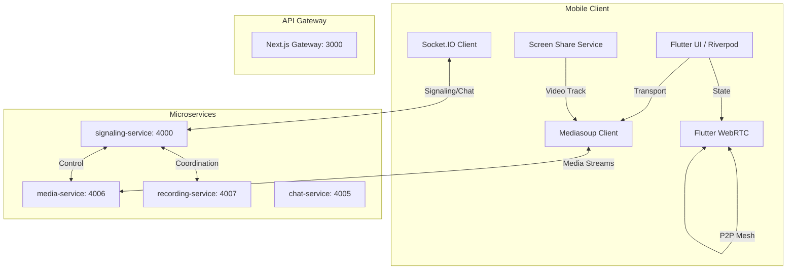
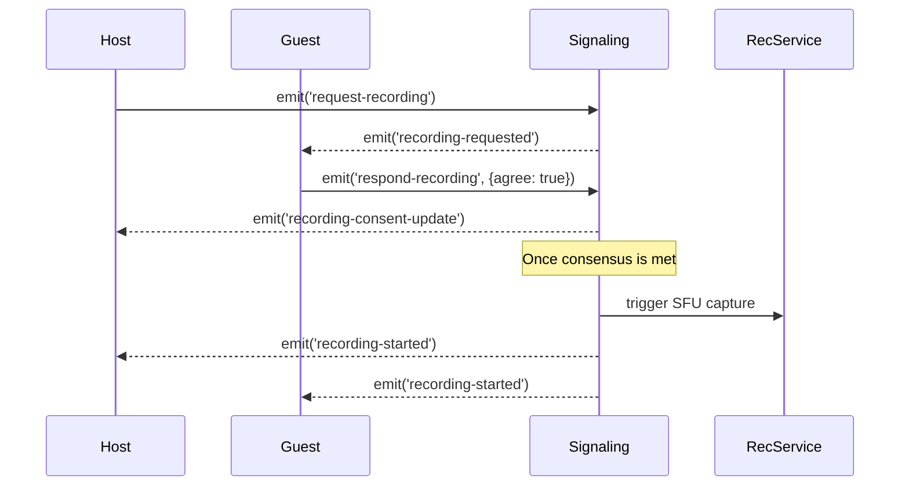
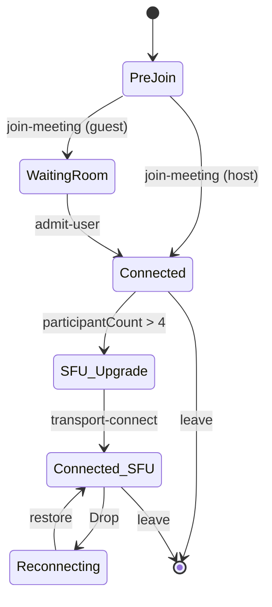

# Mobile-Web Parity Upgrade Blueprint

## Architecture Overview

The upgraded Mizdah mobile architecture transitions from a strict P2P mesh network to a dynamic hybrid model, fully compatible with the existing `media-service` (Mediasoup SFU) on port 4006. The mobile client will intelligently switch transport layers, utilize native broadcasting for screen sharing, synchronize whiteboard vectors, and render server-side Whisper captions.



---

## Media Layer (SFU Integration)

To integrate Mediasoup while maintaining P2P fallback, the app requires `mediasoup_client_flutter`. 

### P2P to SFU Dynamic Switching Logic
- **Condition**: `if (participantCount <= 4) use P2P else use SFU`.
- **Trigger**: When the 5th participant joins, the host triggers a `switch-to-sfu` socket event. All peers tear down P2P connections and initialize Mediasoup transports.

### Transport Setup Code Structure
```dart
import 'package:mediasoup_client_flutter/mediasoup_client_flutter.dart';

class SFUService {
  late Device _device;
  Transport? _sendTransport;
  Transport? _recvTransport;

  Future<void> initDevice(Map<String, dynamic> routerRtpCapabilities) async {
    _device = Device();
    await _device.load(routerRtpCapabilities: RtpCapabilities.fromMap(routerRtpCapabilities));
  }

  Future<void> createSendTransport(Map<String, dynamic> transportOptions) async {
    _sendTransport = _device.createSendTransportFromMap(
      transportOptions,
      producerCallback: _handleProduce,
    );

    _sendTransport!.on('connect', (Map<String, dynamic> data) {
      // Emit 'transport-connect' to signaling server
      socket.emit('transport-connect', {'dtlsParameters': data['dtlsParameters']});
    });

    _sendTransport!.on('produce', (Map<String, dynamic> data) async {
      // Emit 'transport-produce' to signaling server & return producer ID
      final response = await emitWithAck('transport-produce', {
        'kind': data['kind'],
        'rtpParameters': data['rtpParameters'],
        'appData': data['appData'],
      });
      return response['id'];
    });
  }

  Future<Producer> produce(MediaStreamTrack track) async {
    return await _sendTransport!.produce(
      track: track,
      stream: localStream,
      appData: {'mediaType': track.kind},
    );
  }

  Future<Consumer> consume(Map<String, dynamic> consumerOptions) async {
    final consumer = await _recvTransport!.consume(
      id: consumerOptions['id'],
      producerId: consumerOptions['producerId'],
      kind: consumerOptions['kind'],
      rtpParameters: RtpParameters.fromMap(consumerOptions['rtpParameters']),
    );
    return consumer;
  }
}
```

### Signaling Flow
1. **Get Router Capabilities**: Client asks server for `routerRtpCapabilities`.
2. **Device.load()**: Client initializes `Device`.
3. **Create Transports**: Client requests send/recv WebRTC transports from server.
4. **Connect/Produce**: Client emits `connect` and `produce` events with DTLS/RTP parameters.

---

## Screen Sharing

Mobile-native screen sharing routed through SFU requires platform-specific implementations.

### Platform-Specific Integration Plan
- **Android**: Implement a Foreground Service using the `MediaProjection` API. Request `FOREGROUND_SERVICE_MEDIA_PROJECTION` permissions.
- **iOS**: Create a **ReplayKit Broadcast Upload Extension**. Pass frames via `AppGroups` / `CFNotificationCenter` to the main Flutter app.

### Stream Routing Logic
1. Start platform capture -> Obtain `MediaStream`.
2. Extract the `MediaStreamTrack` (video).
3. Use the `_sendTransport!.produce(track: screenTrack, appData: {'mediaType': 'screen'})`.
4. Emit socket event: `socket.emit('screen-share-started')`.

---

## Whisper Captions

The Flutter API must map directly to the backend's `caption-received` event. Whisper parses server-side audio and pushes text.

### Caption State Management Design
```dart
class CaptionState {
  final Map<String, String> activeCaptions; // { socketId: currentText }
  final bool isEnabled;
  final String activeLanguage;
}
```

### UI Integration Structure
- Listen to `caption-received`.
- Expire captions after 5 seconds of `isFinal == true`.
- Dispatch audio through SFU; backend splits audio tracks to Whisper worker.

---

## Recording Lifecycle

The recording flow orchestrates consent across nodes, instructing the `recording-service` to start capturing the Mediasoup router outputs.

### Event Sequence Diagram


### Flutter State Model
```dart
enum RecordingStatus { idle, requestingConsent, recording, stopping, uploading }
```

### Edge Case Handling
- **Host Leaves**: If host drops, recording gracefully stops. `recording-stopped` is emitted.
- **Reconnect**: On `join-meeting`, response includes `isRecording: true`. UI must instantly render recording indicator.

---

## Whiteboard Sync

Synchronized collaborative drawing using scaled coordinates to handle disparate screen ratios.

### Drawing Data Model
```dart
class DrawAction {
  final double x; // NormalizedBox (0.0 to 1.0)
  final double y; // NormalizedBox (0.0 to 1.0)
  final String color;
  final double strokeWidth;
  final String type; // 'start', 'move', 'end'
}
```

### Event Payload Schema
```json
{
  "type": "draw-move",
  "x": 0.453,
  "y": 0.812,
  "color": "#FF0000",
  "width": 2.5
}
```

### Sync Recovery Logic
When a client joins (`join-meeting` ack), request the full stroke history:
`socket.emit('request-whiteboard-state')` → Backend returns array of strokes.

---

## Authentication Alignment

The JWT passed from Flutter must be validated exactly like the Next.js `auth_token` cookie.

### API & Socket Validation Checklist
- [x] Pass JWT in `Authorization: Bearer <token>` for HTTP APIs.
- [ ] Pass JWT during Socket.IO handshake:
  ```dart
  socket = IO.io('http://IP:4000', IO.OptionBuilder()
    .setAuth({'token': jwtToken})
    .build());
  ```
- [ ] Implement `401` global interceptor in `Dio` to refresh token or cleanly logout (wipe Secure Storage, pop to Login).

---

## Socket Contract Map

| Event Name | Direction | Payload Example | Purpose |
|---|---|---|---|
| `get-router-rtp-capabilities` | C -> S | `{}` | Retrieve SFU capacities |
| `create-webrtc-transport` | C -> S | `{ producing: true/false }` | Request transport |
| `transport-connect` | C -> S | `{ dtlsParameters }` | Establish DTLS |
| `transport-produce` | C -> S | `{ kind, rtpParameters }` | Push media |
| `new-producer` | S -> C | `{ producerId, kind }` | Consume remote media |
| `screen-share-started`| C -> S / S -> C | `{ peerId }` | Sync UI state |
| `caption-received` | S -> C | `{ text, isFinal, userId }` | Display Whisper text |
| `draw-move` | C -> S / S -> C | `{ x, y, color }` | Update canvas |

---

## API Contract Map

| Endpoint | Method | Required Web/Mobile Parity Fix |
|---|---|---|
| `/api/recording/start` | POST | Trigger backend FFmpeg composite rather than expecting a physical blob upload from mobile. |
| `/api/meeting/{id}` | GET | Ensure response includes `sfu_mode_active: boolean` to prime transport setup. |

---

## Meeting State Machine



---

## Failure & Recovery Strategy

### Network Reconnect Flow
1. Socket fires `disconnect`.
2. Socket attempts auto-reconnect.
3. On `connect`, emit `resume-session` containing previous `meetingId` and `userId`.
4. Pull latest state: active speakers, recording status, whiteboard vectors.

### Background -> Foreground State Resync
When the OS transitions the app to Foreground:
- Video renderers (`RTCVideoRenderer`) must re-attach `srcObject`.
- Emit `request-state-sync` to ensure no socket events were dropped while iOS/Android throttled background execution.

---

## Performance Optimization

### Battery & Backgrounding
- **Background Mode**: Mute incoming video. Unsubscribe from SFU video consumers using `consumer.pause()`. Resume on foreground.
- **Audio Only**: Provide persistent notification indicating audio is active.

### Bandwidth Adaptation (SFU)
- Use Mediasoup **Simulcast**.
- Mobile produces 3 streams (high, medium, low).
- SFU intelligently downgrades the forwarded stream to receivers based on network conditions (REMB/RTCP feedback) automatically.

---

## Implementation Order

1. **Step 1:** Modify Socket handshake to strictly include the JWT token.
2. **Step 2:** Integrate `mediasoup_client_flutter`. Implement `SFUService` to handle Transport, Producers, and Consumers.
3. **Step 3:** Implement dynamic switching logic (P2P <-> SFU based on participant threshold).
4. **Step 4:** Integrate Whiteboard UI (`CustomPainter`) and connect its socket sync.
5. **Step 5:** Finalize Recording consent flow. Ensure backend handles composite rendering instead of local blob capture.
6. **Step 6:** Scaffold Whisper caption UI and map `caption-received` events to the Riverpod state.
7. **Step 7:** Implement native screen-sharing wrappers (Foreground Service Android / ReplayKit iOS).
8. **Step 8:** Load test with 10+ participants to trigger Simulcast and SFU downgrade logic.
