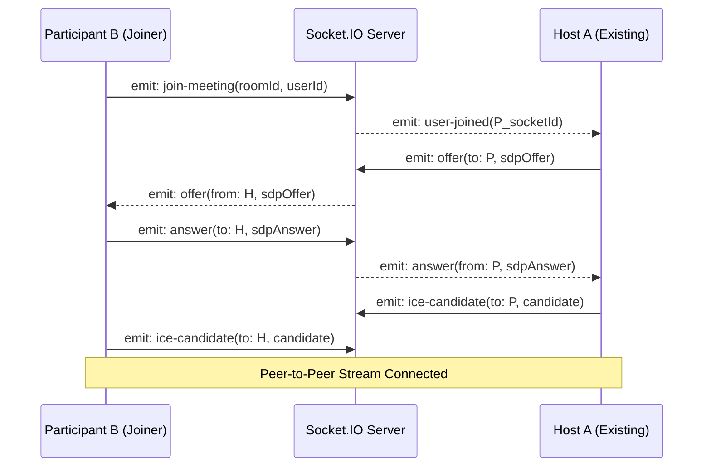

# 📌 PROJECT TECHNICAL DOCUMENTATION — NEWMET (GOOGLE MEET CLONE)

> **Last Updated:** 2026-02-25  
> **Status:** Production-Grade Technical Reference  
> **Architecture:** Microservices with Next.js API Gateway

---

## 📌 1. Project Overview
**Newmet** is a robust, real-time video conferencing platform built to mirror the functionality of Google Meet. It features a distributed architecture consisting of over 12 specialized microservices, a central Next.js API Gateway, and a React-based frontend. Key features include dynamic Peer-to-Peer (P2P) and SFU (Selective Forwarding Unit) switching, persistent multi-user chat, live captions via Whisper, and secure meeting rooms with waiting room logic.

---

## 📁 2. Folder Structure

### Frontend & Gateway
```text
/
├── app/                    # Next.js App Router
│   ├── (admin)/            # Admin Dashboard (Stats, User Mgmt, Plans)
│   ├── (app)/              # User Dashboard (Meeting creation/list)
│   ├── (meeting)/meeting/[id]# The Video Room Component (WebRTC Logic)
│   ├── api/                # API Gateway (Proxies to Microservices)
│   ├── globals.css         # Tailwind & Global Styles
├── components/             # Shadcn/UI & Custom Meeting Components
├── hooks/                  # usePeer, useMediaStream, useSFU, useRecorder
├── lib/                    # Shared utils (Prisma, API, UUID)
└── public/                 # Static assets (logos, icons)
```

### Backend Microservices
```text
/backend/
├── auth-service/           # Port 4004: User registration & JWT login
├── meeting-service/        # Port 4001: Room configuration & settings
├── signaling-service/      # Port 4000: Socket.IO WebRTC signaling
├── chat-service/           # Port 4005: Store/retrieve in-meeting messages
├── participant-service/    # Port 4002: Join/Leave audit logs
├── media-service/          # Port 4006: Mediasoup SFU management
├── recording-service/      # Port 4007: Session recording & R2 upload
├── history-service/        # Port 4003: Post-call summary storage
├── notification-service/   # Port 4008: Meeting invites & reminders
├── scheduling-service/     # Port 4009: Calendar & future meetings
├── file-service/           # Port 4010: Chat attachment uploads
└── admin-service/          # Port 4011: Analytics, logs, and system mgmt
```

---

## 📡 3. API Documentation (Gateway URLs)

| Service | Proxy Prefix | Key Endpoint | Method | Purpose |
|---------|--------------|--------------|--------|---------|
| **Auth** | `/api/auth` | `/login` | `POST` | Validates user & sets HTTP-only cookie |
| **Meeting** | `/api/meetings` | `/create` | `POST` | Generates new room with default settings |
| **Meeting** | `/api/meeting` | `/{id}` | `GET` | Fetches room config & current host |
| **Chat** | `/api/chat` | `/send` | `POST` | Persistent message storage |
| **Admin** | `/api/admin` | `/stats` | `GET` | Aggregated usage metrics |

### Request/Response Example (Auth Login)
**POST** `/api/auth/login`
```json
// Request
{ "email": "user@example.com", "password": "..." }

// Response (200 OK)
{
  "user": { "id": "uuid", "name": "...", "role": "USER" }
}
// Note: JWT is set automatically in an 'auth_token' cookie.
```

---

## 🔐 4. Auth Flow
1. **Frontend**: Submit login form to Next.js API route.
2. **Gateway**: Route extracts body and forwards to `auth-service:4004/login`.
3. **Auth Service**: Checks DB (Bcrypt passwords), generates JWT with `userId` and `role`.
4. **Gateway Implementation**:
   - Next.js receives JWT from microservice.
   - Sets a secure, `httpOnly` cookie (`auth_token`) on the response.
   - For Mobile: JWT is returned in the response body for storage in Secure Storage.

---

## 🧠 5. WebRTC Signaling Flow

The `signaling-service` acts as the broker for all WebRTC handshakes.



---

## 🔄 6. Socket Events (Port 4000)

| Event (Emit/On) | Payload | Description |
|-----------------|---------|-------------|
| `join-meeting` | `{ meetingId, userId, name }` | Adds user to room. If host, admits others; if guest, enters waiting room. |
| `request-to-join`| `{ socketId, name }` | Sent to Host when a guest is waiting. |
| `admit-user` | `{ socketId }` | Host calls this to pull a guest from waiting room to JOINED state. |
| `send-caption` | `{ text, isFinal }` | Broadcasts real-time AI transcription to all. |
| `request-recording`| `(none)` | Triggers a consensus popup to all participants. |
| `recording-started`| `{ recorderId, startTime }` | Broadcasted once all participants agree to record. |
| `mute-user` | `{ socketId }` | (Host Only) Remote command to disable a participant's mic. |

---

## 🗄 7. Database Schema (PostgreSQL)

Utilizes **Prisma** with a PostgreSQL multi-schema strategy.

- **`auth.users`**: Core user profiles and credentials.
- **`meeting.meetings`**: Configuration (e.g., `private_chat_enabled`, `max_participants`).
- **`chat.chat_messages`**: Content, sender details, and attachment metadata.
- **`participant.participants`**: Audit trail of `joined_at` and `left_at` timestamps per user per meeting.
- **`recording.recordings`**: Cloud storage (R2) URLs and file metadata.
- **`admin.audit_logs`**: System-wide event tracking (signups, meeting force-ends).

---

## 🔑 8. Environment Variables

```env
DATABASE_URL="postgresql://..." # Postgres connection string
JWT_SECRET="super-secret-key"   # Key for signing tokens

# Microservice URLs (Proxy Destinations)
AUTH_SERVICE_URL="http://127.0.0.1:4004"
MEETING_SERVICE_URL="http://127.0.0.1:4001"
SIGNALING_SERVER="http://localhost:4000"

# Storage (R2/S3)
R2_ENDPOINT="https://..."
R2_ACCESS_KEY_ID="..."
R2_SECRET_ACCESS_KEY="..."
R2_BUCKET="..."
```

---

## 📱 9. Mobile App Integration Guide

### Connectivity Workflow
1. **Host Connection**: Point the mobile app to the PC's Internal IP (e.g., `192.168.x.x:3000`).
2. **Authentication**: Use `POST /api/auth/login`. Store the returned JWT locally. Pass it in `Authorization: Bearer <token>` for all other HTTP calls.
3. **WebRTC**:
   - Use `flutter_webrtc` or React Native WebRTC.
   - Connect to signaling on port 4000.
   - **Crucial**: Respond to `offer` and `ice-candidate` events exactly as the web client does.

---

## 📞 10. Meeting Lifecycle Logic

### Join Flow
1. **Pre-check**: App calls `/api/meeting/{id}` to verify room existence.
2. **Permission**: Request Camera/Mic permission.
3. **Signaling**: Connect to Socket.IO and emit `join-meeting`.
4. **Admission**: If the user is not the host, stay in `WAITING_FOR_APPROVAL` state until `join-confirmation` is received.

### Leave Flow
1. **Cleanup**: Stop all local media tracks (`stream.getTracks().forEach(t => t.stop())`).
2. **Signaling**: Socket disconnects automatically; server broadcasts `user-left`.
3. **Logging**: Frontend calls `/api/participant/leave` to finalize database record.

---

## 🛡 11. Security Implementation

- **HTTP-Only Cookies**: Prevents XSS-based token theft on the web.
- **Server-Side Validation**: Meeting IDs and user identities are validated in the microservices before signaling is allowed.
- **Waitlist Logic**: Guests cannot gain WebRTC signaling access until explicitly admitted by the host.
- **Permission Guards**: Meeting settings (like `screenshare_enabled`) are checked at the Gateway level before requests are proxied.

---

## 🚀 12. Deployment Instructions

1. **Database**: Initialize PostgreSQL and run `project_schema.sql`.
2. **Env Setup**: Create `.env` files in `backend/signaling-service`, `backend/auth-service`, etc., with correct DB URLs.
3. **Services**: Start all backends (PM2 recommended):
   ```bash
   pm2 start backend/server.js --name gateway
   pm2 start backend/signaling-service/server.js --name signaling
   # ... [repeat for all 12 services]
   ```
4. **Frontend**: Build and start:
   ```bash
   npm run build
   npm run start
   ```

---
*Created by Senior Architect — Newmet Documentation 2026*
